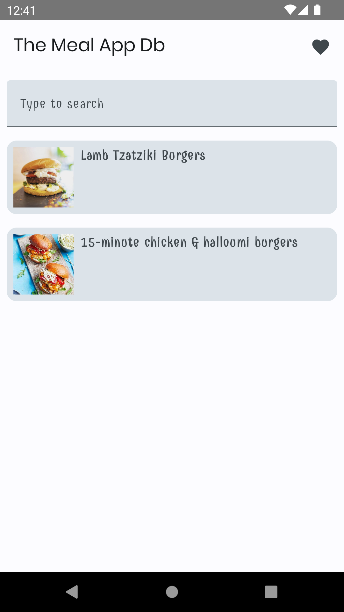
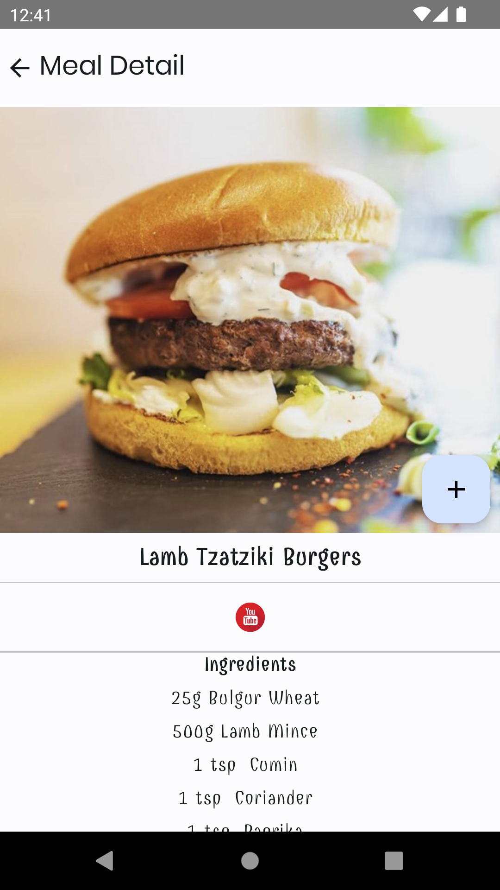
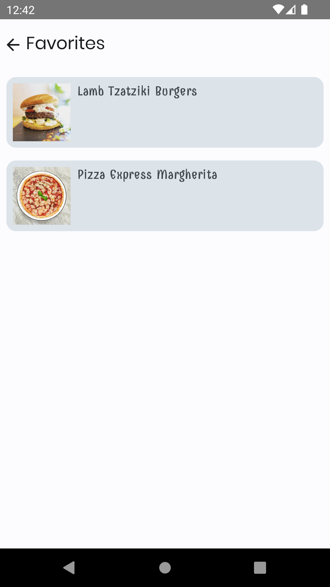

# The Meal DB App - Jetpack Compose Android MVVM

Sample application with clean architecture

In this app you'll find:
*   User Interface built with **[Jetpack Compose](https://developer.android.com/jetpack/compose)**
*   Navigation using **[Navigation Compose](https://developer.android.com/jetpack/compose/navigation)**.
*   Dependency injection using [Hilt](https://developer.android.com/training/dependency-injection/hilt-android).
*   Clean Architecture

## Screenshots

|  |  |  |
|---|---|---|